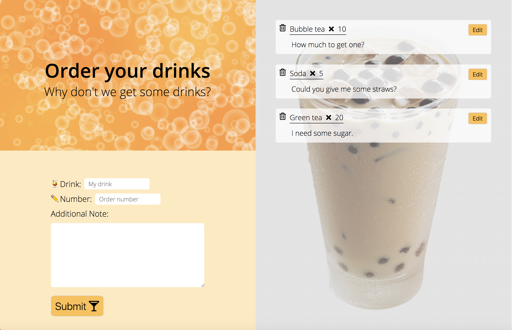

# Dailydrinks
This is a small website for corporations to order the drinks.
## Features

1. Provide ordering, deleting and editing of lists of drinks 

2. Built in a RWD pattern

3. Used the ES6 and MVC structure to develop the website

4. Provide data persistences after page reloaded

## How to use it

- Fill the form to add a new order
- Click small trash can icons in lists to delete orders
- Press Edit icon to update orders in the same form of adding new drinks 
 

  

